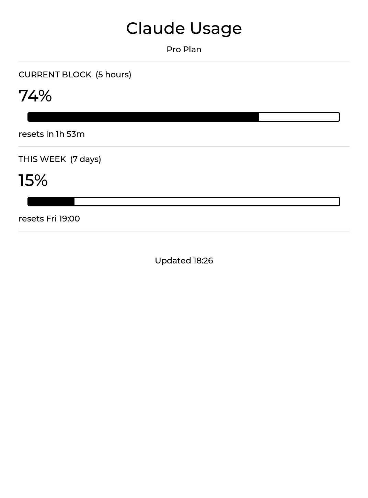

# inkmeter

Turn an old jailbroken Kindle into an always-on, glanceable **AI usage dashboard**.
It shows your Claude usage limits (5-hour block + 7-day week) on the e-ink screen
like a lockscreen, refreshes itself every few minutes, and sips almost no battery
by truly suspending between updates.



> **v1** tracks [claude.ai](https://claude.ai) usage. Multi-provider support
> (OpenAI, Gemini, …) is planned — see [Roadmap](#roadmap).

## How it works

- A small **LVGL/C++** binary renders the usage screen straight to the framebuffer.
- A shell controller (`dashboard.sh`) runs the show: render → arm an **RTC alarm**
  → `echo mem` (true suspend) → wake on the alarm → render again.
- While suspended the device ignores touch (lockscreen-like) and draws ~no power;
  the e-ink panel holds the last image for free.
- WiFi is only associated for the few seconds each refresh needs, then disconnected.

## Requirements

- A **jailbroken** Kindle with **KUAL** and SSH access (USBNetwork or WiFi SSH).
  Developed on a Paperwhite 3 (PW3).
- A Linux host with `cmake` to build (the cross-compiler, Zig, is fetched
  automatically by `deploy.sh`).

## Build & install

```sh
git clone --recurse-submodules git@github.com:tkiethuynh/inkmeter.git
cd inkmeter
KINDLE=root@<kindle-ip> ./deploy.sh
```

`deploy.sh` downloads Zig, cross-compiles the ARM binary, and copies the binary
and the KUAL extension to `/mnt/us/extensions/ai-usage/` on the Kindle.

On first install it seeds a config file you must edit on the Kindle:

```
# /mnt/us/extensions/ai-usage/config
SESSION_KEY=sk-ant-sid02-...   # your claude.ai sessionKey cookie
REFRESH_MINS=5                 # refresh interval in minutes
```

Get `SESSION_KEY` from a desktop browser: DevTools (F12) → Application → Cookies
→ `https://claude.ai` → copy the `sessionKey` value.

> Treat this cookie like a password — it grants access to your Claude account.
> It lives only in the local config file (git-ignored) and on your Kindle.

## Usage

From the Kindle: **KUAL → AI Usage → Start Dashboard**.

- The screen shows current usage with the frontlight on for ~1 minute, then goes
  dark and refreshes silently every `REFRESH_MINS`.
- **Press the power button** to return to the Kindle: it wakes to the lockscreen,
  press once more for home (native Kindle two-step wake — see Limitations).
- **KUAL → AI Usage → Stop / Restore Kindle** tears the dashboard down completely.

## Limitations

- **Two-press exit.** Waking from suspend lands on the Kindle's native
  screensaver/lockscreen; a second press reaches home. Collapsing this to one
  press isn't possible on this firmware without patching the framework.
- A failed/expired `sessionKey` is shown on screen ("Session expired …"); a
  transient network blip keeps the last good reading instead.

## Roadmap

- **v2 — multi-provider:** a provider list in config, one fetch module per
  service, and N usage rows. The renderer is already generic; the work is the
  fetch/parse layer and config schema.

## License

MIT — see [LICENSE](LICENSE).

Built with [LVGL](https://github.com/lvgl/lvgl) and cross-compiled with
[Zig](https://ziglang.org/). Not affiliated with Anthropic or Amazon.
